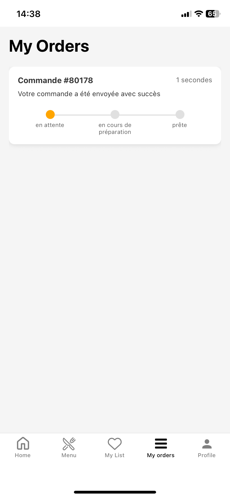

# Connected Restaurant Client Mobile App

A mobile application designed for connected restaurants, enabling customers to enjoy seamless and personalized dining experiences. Through this app, users can browse restaurant menus, place orders, make secure payments, manage reservations, and benefit from real-time recommendations and loyalty tracking—all from their tablet or smartphone.

## Features

- **Menu Browsing:** Explore restaurant menus, view detailed dish descriptions, and customize orders.
- **Order Placement:** Place orders directly from your device and receive updates in real-time.
- **Secure Payments:** Make safe and fast payments using integrated payment gateways.
- **Reservation Management:** Book, modify, or cancel reservations with ease.
- **Real-time Recommendations:** Get personalized food and drink suggestions based on preferences and history.
- **Loyalty Tracking:** Monitor your rewards and loyalty points seamlessly.
- **Personalized Experience:** Access tailored offers, favorite dishes, and previous orders.

## Screenshots

<div>
  
  
  
</div>

## Getting Started

1. **Clone the repository:**
   ```bash
   git clone https://github.com/larabiislem/Connected-restaurant_client-mobile-app.git
   cd Connected-restaurant_client-mobile-app
   ```

2. **Install dependencies:**
   ```bash
   npm install
   # or
   yarn install
   ```

3. **Run the app:**
   ```bash
   npm start
   # or
   yarn start
   ```

## Technologies Used

- **JavaScript** (99.3%)
- **TypeScript** (0.7%)
- React Native / Expo (if applicable)
- Additional libraries for state management, UI components, and API communication

## Contribution

We welcome contributions! Please open an issue or submit a pull request with your improvements.

## License

This project is licensed under the MIT License.

---

**Contact:**  
For support or questions, contact [Islem Larabi](https://github.com/larabiislem).
